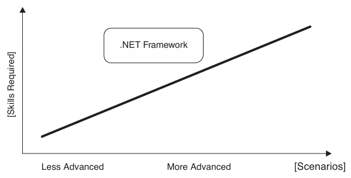
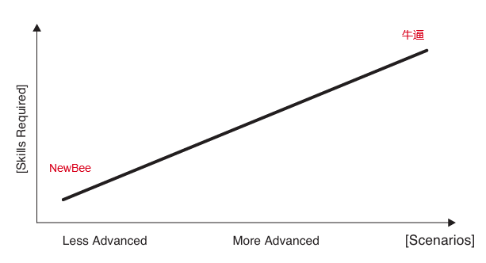
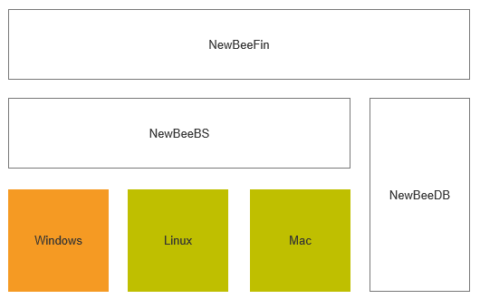
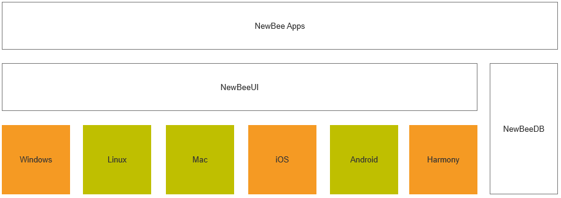

# 关于 NewBee

## NewBee 原则

NewBee 有两层意思：一是 NewBee，新手。二是发音牛逼，高手的意思。

我非常喜欢《Framework Design Guidelines》(中文名: 《.NET设计规范 约定、惯用法与模式》) 中的一个说法，就是好的库，要入门很容易，但又能做高阶场景，要有一个平滑的学习曲线。正因为如此，dotnet 标准库公认的非常好用。

图1 learning curve of a progressive framework platform (from 《Framework Design Guidelines》)

我不喜欢 xaml，原因也是它不符合这个原则。

我把上面这个图稍微改了改，左下角是 NewBee，右上角是牛逼，既要NewBee，又要牛逼。

## NewBee 宣言

- 新手易上手，零门槛开启技术探索
- 高手能深耕，高上限解锁硬核玩法
- 简单是初心，复杂需求也轻松落地
- 入门无壁垒，人人皆可玩转核心功
- 进阶有深度，步步进阶练就大神力
- 以新手之名，做最牛逼的技术实践

注: 上述宣言由豆包生成

## NewBee 开源系列

- [NewBeeUI](https://github.com/nscript-site/NewBeeUI): 基于 Avalonia Markup 的极简客户端和移动端 APP 开发的极简 UI 库，基于 VU 模式（MVU中去除了M），支持 NativeAOT。

- [NewBeeBS](https://github.com/nscript-site/NewBeeBS): 基于 Blazor Server 的简单后台，使用 LiteDB 来管理数据，有基本的用户管理功能，适合用于 AI 后台产品开发。

- [NewBeeDB](https://github.com/nscript-site/NewBeeDB)：dotnet 下嵌入式向量数据库实现，可自定义扩展。

- [NewBeeFin](https://github.com/nscript-site/NewBeeFin)：AI辅助金融投资研究工具，基于 blazor server 开发。

## 体系结构

### （1）BS 架构 

这是针对 AI BS 应用的架构，单机或局域网使用，基于 Blazor Server 开发，默认 JIT 运行，不考虑 AOT。默认在 Windows 上开发和运行，理论上，也支持 Linux 和 Mac。

- 这套架构用于 2B，已经交付了不少客户了，主要平台 Linux（ x64、Arm64）

- NewBeeFin 是我自己用，辅助分析上司公司的基本面。

### （2）APP 架构

这个是我做跨平台 APP 的架构。重点测试 Windows、iOS、鸿蒙 三个平台，理论上，兼容 Linux、Mac、Android 平台。默认通过 AOT 来运行，JIT 一般只在开发时用用。之所以搞出 NewBeeDB，也是为了能在这六个平台上做 AI 类应用。

## about me

大龄程序员，数字游民。目前在尝试 AI 辅助下的超级个体路线。兴趣领域：

（1）金融：

- 大模型辅助进行上市公司的基本面分析，辅助技术指标，进行中长线交易，已经形成完整的交易系统
- 从上市公司财报里挖掘好玩的事情

（2）AI APP：

- 看图类 APP
- 扫描类 APP
- 3D及具身智能类 APP